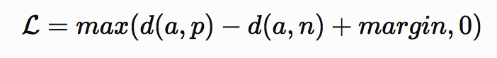
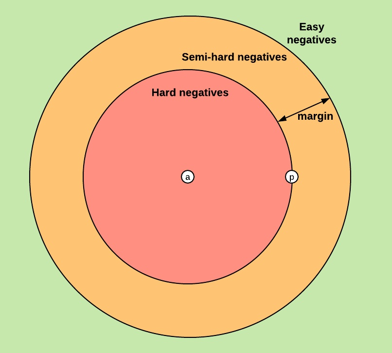

## Triplet Loss

三元组损失，原本用于图像人脸embedding的生成，很好理解，公式如下，这里我们用来作为句子represent的训练损失，
来收敛句子的embedding：  

### 损失函数公式：

### 可视化损失:

### 损失函数的pytorch实现：
代码已做过gpu上训练的适配：  
[triplet_loss.py](model/triplet_loss.py)
- 实现策略：  
我们选择的是batch_hard策略，即在一个batch中，循环定义每一个样本为anchor，选择距离anchor最大的positive exmaple
记为：d(a,p)；选择距离anchor最小negtive example，记为d(a,n)，我们的目标是通过训练尽可能缩小d(a,p)，增大d(a,n)；
对于1个anchor来说，loss=max(hardest_positive_dist - hardest_negative_dist + margin,0)。
假定batch=64，距离计算采用欧式距离，我们会将一个batch中的距离求平均，作为当前batch的损失

## Model Structure 
- 模型结构采用CNN + 时序模型Bilstm  
- 超参数配置在conf/model.yaml  

## Model Features
- 词级别的特征融合词属性特征，是word + word_feature的结构  
- 特征用一套领域化的辞典维护：config/specific_words.txt  
词特征的引入对于句子的语义表征尤为重要，当推理过程中，出现新词，可以通过添加辞典的方式，强化生词的属性特征，从而推理得到的
句子表征更加合理，在最终相似度计算时能够更贴近实际class对应的句子表征。  
- 处理举例：  
处理前：|今天我想看湖南卫视的快乐大本营|  
处理后：|今天/我/想/看/湖南卫视/<channel>/的/快乐大本营/<show>|  
模型层需要对特征词<channel>和<show>做表征，融合方式有很多，我这里采用的embedding拼接的方式。  
- 特征构建方案采用ac_tree的树搜索/utils/preprocess.py 及 /utils/ac.py  

## 新增类别
- 该项目结构可以做到新增类别时，不训练模型；  
通过配置文件data/add/extra.csv添加需要的extra_text和class，在推理阶段会同时计算extra_text的句子表征，在相似度计算时，
会将extra_text所得到的表征一并纳入计算范围，若match成功，则返回extra_text对应的class。  
- 该方案同样适用于badcase的快速修复  

## faiss
- 来自facebook的向量搜索框架：https://github.com/facebookresearch/faiss  
该框架可以做很多事情，具体自行研究。我这里用到的样本数量过百万，推理时同样需要计算百万级的句子表征，因此借助faiss来加速。  

## 相似度计算
- cosine_similarity;  
我这里采用余弦计算句子相似度，返回top1结果，注意faiss中没有直接计算余弦的方法,方案是先对向量做normalize,再做点积，得到的
结果就是余弦相似度，基本的数学知识。

## 模型训练
- 数据放在data文件夹，执行run.py

## 模型推理
- text_match_with_server.py
### 模型初始化：
tm = TextMatch(ip_port='localhost:50051')
- 参数说明：  
    ip_port:faiss server的地址及端口号  
### 模型推理：
confidence, similar_text, pred_label = tm.inference(text)  
- 参数说明：  
    text:用户的input_text 类型：str  
    return:  
       confidence:置信度 类型：float  
       similar_text:top1接近的text 类型：str  
       pred_label:预测结果标签 类型：str  